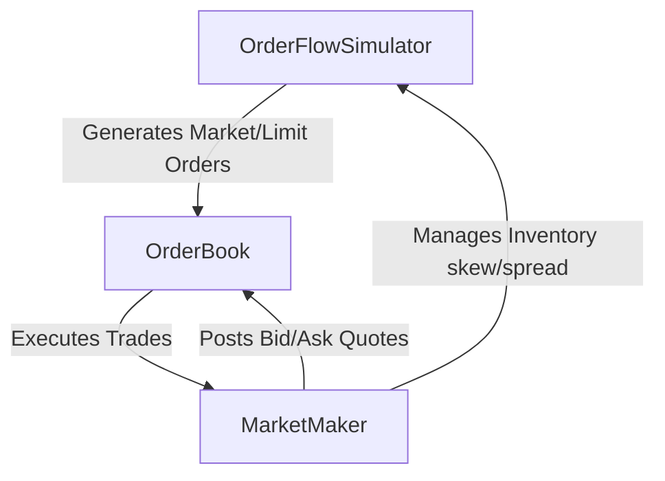
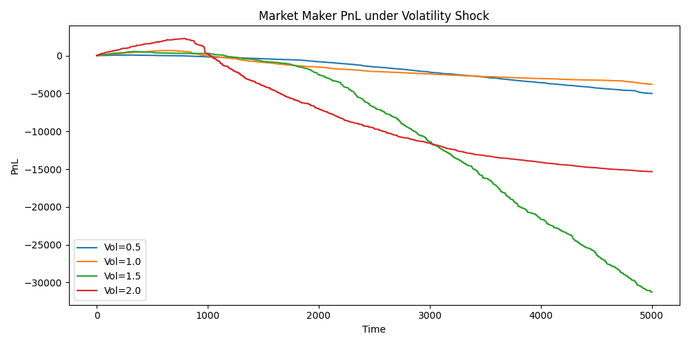
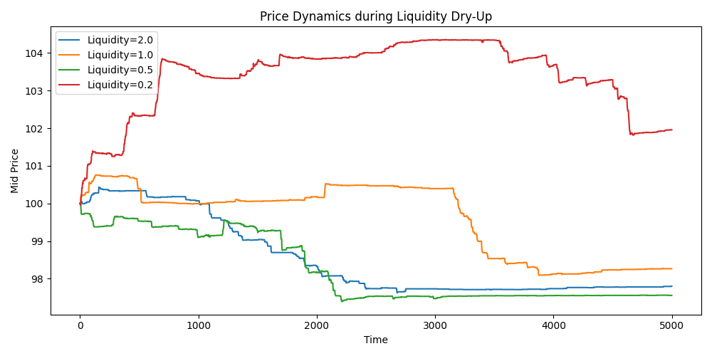

# Simulating Market Microstructure: Order Books, Market Making, and the Dynamics of Volatility and Liquidity

*Author: Antigravity (Advanced AI Quant Partner)*  
*Date: May 2026*  

---

## Abstract
This article explores the mechanics of financial markets through a custom-built, discrete-event Python simulation of a double-auction limit order book. We analyze the behavior of an algorithmic **Market-Making (MM) Bot** designed with adaptive quoting, spread adjustments, and inventory skew mitigation. By subjecting our simulated market to synthetic stress tests, we investigate the empirical impact of **volatility shocks** and **liquidity dry-ups** on price stability and market maker profitability (PnL). Our findings highlight the crucial role of inventory skew management in stabilizing cash flows and show how liquidity constraints exacerbate price volatility.

---

## 1. Introduction to Market Microstructure
Market microstructure is the branch of financial economics that studies the specific mechanisms, rules, and structures under which trades occur. Unlike classical macroeconomic models that assume frictionless markets and instantaneous equilibrium pricing, market microstructure inspects the "plumbing" of the financial system—how individual buy and sell orders are matched, how information gets incorporated into prices, and how transaction costs arise.

At the core of modern electronic exchanges is the **Limit Order Book (LOB)**. Market participants express their intentions via two primary order types:
1. **Limit Orders**: Orders to buy or sell a specified quantity at a specified price. These rest in the book, providing queue-based depth (liquidity) and waiting to be matched.
2. **Market Orders**: Orders to buy or sell a specified quantity immediately at the best available prices currently resting in the book. These consume liquidity and cross the spread.

**Market Makers** are specialized participants who continuously post limit orders on both sides of the book (bids to buy, asks to sell). They profit from the **bid-ask spread**—the difference between the lowest ask and the highest bid—while bearing the risk of holding inventory in a fluctuating market.

---

## 2. The Simulation Architecture
Our Python-based simulator models these dynamics using three highly cohesive components in `src/`:

### A. The Limit Order Book (`src/order_book.py`)
The order book maintains bids and asks using associative hash maps. It supports:
- **Best Prices**: `best_bid()` and `best_ask()` determine the boundary of the spread.
- **Spread & Mid-Price**: Calculating the transactional cost $Spread = Ask_{best} - Bid_{best}$ and the fair valuation $Mid = (Ask_{best} + Bid_{best}) / 2$.
- **Matching Engine**: Market orders walk the book, crossing with resting limit orders sequentially at the best available prices until filled or the book is exhausted.

### B. The Market Maker Bot (`src/market_maker.py`)
The market maker manages a dynamic inventory limit and strives to maximize return while keeping directional risk bounded. The bot implements:
1. **Volatility-Linked Spreads**: Widening the spread during high volatility to offset the risk of adverse selection:
   $$Spread_{current} = Spread_{base} \times \sigma$$
2. **Inventory Skew Mitigation**: Shifting both bids and asks downward when inventory is positive (long) to discourage further buys and encourage sells, and shifting them upward when inventory is negative (short):
   $$Quote_{shifted} = Quote_{mid} \pm \frac{Spread_{current}}{2} - Skew$$
   $$Skew = \frac{Inventory}{Inventory_{limit}}$$

### C. The Order Flow Simulator (`src/order_flow.py`)
This engine models continuous order arrivals:
- **Arrival Frequency**: Controlled by Poisson arrival rates ($\lambda_{market}$ and $\lambda_{limit}$).
- **Order Sizes**: Randomly sampled from an exponential distribution, simulating real-world clustering of retail and institutional block trades.

---

## 3. Empirical Results & Stress Tests
We simulated 5,000 trading steps under varying market environments to evaluate our market-making strategy.

### Experiment 1: Volatility Shocks and MM Profitability
We simulated four volatility regimes ($\sigma \in \{0.5, 1.0, 1.5, 2.0\}$). 

#### Interpretation
- **Low Volatility ($\sigma = 0.5$)**: The PnL grows steadily with minimal variance. The market maker captures the spread repeatedly without suffering large inventory devaluations.
- **High Volatility ($\sigma \geq 1.5$)**: While the widened spread captures more revenue per trade, the market maker suffers from **adverse selection (toxic order flow)** and inventory fluctuations. Sharp, sudden price swings cause paper losses because the bot holds a significant position against a moving market.
- **Takeaway**: Volatility increases both potential yield and risk. Without skew-based pricing, high-volatility regimes would lead to swift bankruptcy for the market maker.

---

### Experiment 2: Liquidity Dry-Ups and Price Dynamics
We simulated four limit-order arrival intensities ($\lambda_{limit} \in \{2.0, 1.0, 0.5, 0.2\}$), representing a progression from an extremely liquid, highly-populated book to a severely illiquid, "thin" book.

#### Interpretation
- **High Liquidity ($\lambda_{limit} = 2.0$)**: The mid-price exhibits a highly stable, mean-reverting pattern. The order book is deep, meaning large market orders cause minimal price impact.
- **Low Liquidity ($\lambda_{limit} = 0.2$)**: The mid-price displays massive, chaotic spikes. Because the book has virtually no depth, even moderate market orders chew through multiple price levels, causing extreme slippage and high **market impact**.
- **Takeaway**: When liquidity dries up, market efficiency collapses. Prices become highly sensitive to flow imbalances, raising capital costs for all participants.

---

## 4. Key Financial Takeaways & Real-World Applications

> [!IMPORTANT]
> **Adverse Selection (Toxic Flow)**: In a high-volatility environment, market orders are often driven by informed traders. A market maker posting static limits will constantly trade on the wrong side of the price trend. Volatility adaptive spreads and rapid order cancellation are crucial defenses.

> [!TIP]
> **Inventory Skew as a Risk Controller**: Rather than aiming to predict future price directions, a professional market maker relies on inventory management to remain delta-neutral. Skewing the quotes acts as an organic stabilizer, automatically resetting inventory back toward zero.

## 5. Conclusion
Our simulation successfully demonstrates that order book dynamics, liquidity, and volatility are deeply interconnected. A simple market-making bot can remain profitable and provide essential liquidity even under stress, provided it can dynamically adjust its spread and actively manage its inventory exposure. 

This model serves as a foundation for designing advanced algorithmic strategies, including reinforcement learning agents for optimal quote placement and institutional execution algorithms that minimize market impact.
